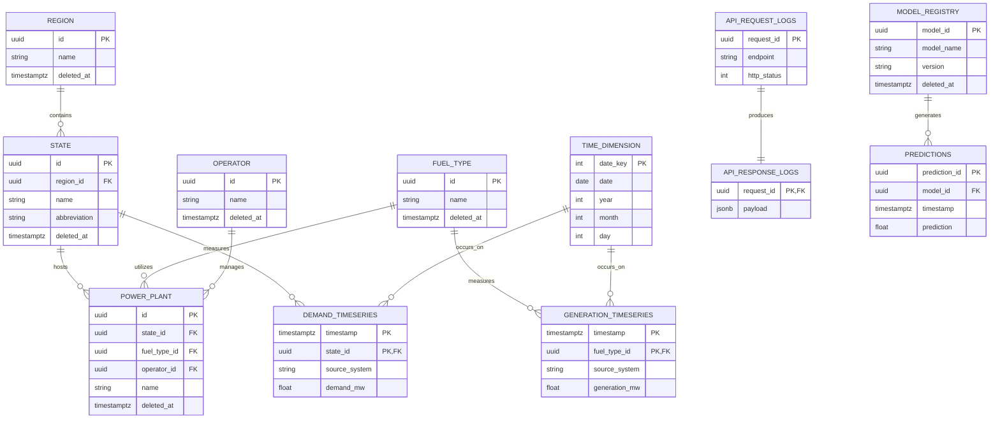

# Entity Relationship Diagram Design (GridSense AI)

**Version:** 1.1  
**Status:** ERD Approved  
**Author:** Data Architecture Team  

---

## 1. Introduction

This document outlines the logical Entity Relationship Diagram (ERD) for GridSense AI. It strictly adheres to the dimensional modeling architecture defined in `DATABASE_ARCHITECTURE.md`. The design prevents the "one-table-per-API" anti-pattern, enforcing a rigid separation between transactional (Fact) data and reference (Dimensional) data.

---

## 2. Entity Overview

The entities are broadly grouped into Dimensions (Master/Reference Data), Facts (Transactional/Time-Series), Ingestion Metadata, and Machine Learning.

### Dimensions
- `region`, `state`, `fuel_type`, `market_type`
- `operators`, `owners`, `voltage_levels`
- `time_dimension` (A comprehensive calendar dimension with an integer `date_key`)
- `power_plant`, `substation`, `transmission_line`

### Facts (Time-Series)
- `demand_timeseries`, `generation_timeseries`, `grid_frequency_timeseries`, `carbon_intensity_timeseries`
- `iex_dam_pricing`, `iex_rtm_pricing`, `iex_gdam_pricing`
- `operations_psp`

### Ingestion Metadata
- `dataset_registry`: Master list of datasets and refresh strategies.
- `api_request_logs`: Tracks SDK calls, rate limits, and latency.
- `api_response_logs`: Tracks payload structures and detailed API responses for debugging.
- `refresh_history`: Tracks the status of ETL pipeline runs.

### Machine Learning
- `model_registry`: Tracks deployed forecasting models.
- `predictions`: Stores historical predictions to calculate MAE against actual facts.

---

## 3. Entity Descriptions

| Entity | Purpose | Responsibilities | Expected Size | Update Frequency |
|--------|---------|------------------|---------------|------------------|
| `state` | Geopolitical states. | Maps demand and infrastructure to states. | ~36 rows | Rarely |
| `time_dimension` | Calendar dimension for BI. | Enables aggregation by Day/Month/Quarter. | ~36,500 rows | Yearly |
| `power_plant` | Physical generation asset. | Stores capacity, location, and metadata. | ~20,000 rows | Monthly |
| `demand_timeseries`| Records load requirements. | Tracks state/region power demand. | Millions | Every 15 min |
| `dataset_registry` | Data Lineage tracker. | Defines refresh rules per dataset. | ~50 rows | Rarely |

---

## 4. Relationships & 5. Cardinality

| Parent Entity | Cardinality | Child Entity | Description / Relationship Reason |
|---------------|:-----------:|--------------|-----------------------------------|
| `region` | 1 → N | `state` | A region physically contains multiple states. |
| `state` | 1 → N | `demand_timeseries` | Demand is recorded at the state level over time. |
| `time_dimension`| 1 → N | *All Fact Tables* | Every time-series event joins to the `date_key`. |
| `operators` | 1 → N | `power_plant` | An operator manages multiple plants. |
| `model_registry`| 1 → N | `predictions` | A model generates many predictions. |
| `api_request_logs`| 1 → 1 | `api_response_logs`| Every request maps to a detailed response. |

---

## 6. Primary & Foreign Key Strategy

### Primary Keys
- **Dimensions:** Use **UUIDv7** (or `UUIDv4`).
- **Time Dimension:** Use a Kimball-style `date_key INTEGER` (e.g. 20260717).
- **Facts (Time-Series):** Use **Composite Natural Keys** `(timestamp, dimension_id)`.

### Foreign Keys
- Enforce `ON DELETE RESTRICT` for reference targets.

### Soft Deletes
- Replaced boolean `is_active` flags with `deleted_at TIMESTAMPTZ` for precise historical auditing.

### Fact Table Source Tracking
- Every fact table incorporates a `source_system VARCHAR(50)` (e.g. 'EnergyAtlas') to support multi-source flexibility.

---

## 7. Mermaid ER Diagram

---

## 8. Validation Checklist

- [x] **Time Dimension Adjusted:** Uses `date_key INTEGER` instead of `DATE`.
- [x] **Additional Reference Entities:** Added Operators, Owners, etc.
- [x] **Source System Added:** Appended to all fact definitions.
- [x] **ML & Ingestion Registry Added:** Scaled architecture for later roadmap phases.
- [x] **Soft Delete Modernized:** Transitioned from `is_active` to `deleted_at`.
- [x] **API Logs Decoupled:** Split request metadata from heavy response payloads.
