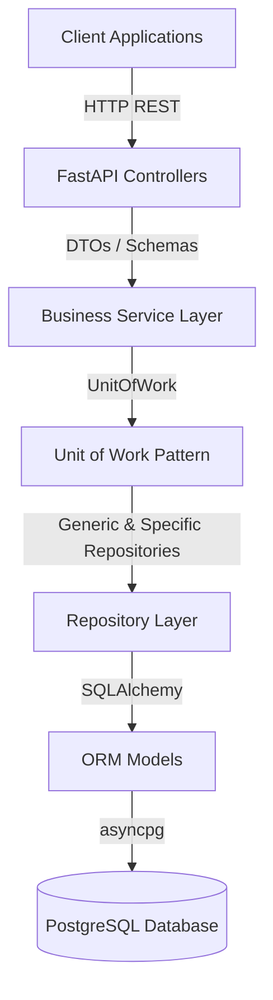

# Backend Architecture Overview

GridSense AI's backend is built using a strict implementation of **Clean Architecture** and **SOLID** principles, ensuring separation of concerns, testability, and high maintainability.

## Technology Stack
- **Web Framework**: FastAPI (Asynchronous Python)
- **Database**: PostgreSQL
- **ORM**: SQLAlchemy 2.0 (Async)
- **Migrations**: Alembic
- **Security**: JWT, Passlib (Argon2/Bcrypt)
- **Package Management**: Poetry or native pip (`requirements.txt` / `pyproject.toml`)

## Architectural Layers

### 1. API Layer (`app/api/`)
Handles HTTP requests, path routing, dependency injection (authentication/authorization), and input/output validation via Pydantic schemas. 
- *Rule*: No business logic is permitted in the API layer.

### 2. Service Layer (`app/services/`)
Houses the core business logic, analytics calculations, and workflow orchestrations. 
- *Rule*: Services only interact with the Repository layer via the Unit of Work. They never execute raw SQL or handle HTTP requests.

### 3. Unit of Work (`app/repositories/unit_of_work.py`)
Provides an abstraction over the SQLAlchemy session lifecycle, ensuring all repository modifications occur within a single ACID transaction boundary.

### 4. Repository Layer (`app/repositories/`)
Abstracts database access. Provides a `GenericRepository` for standard CRUD, which is inherited by specific repositories (e.g. `EnergyRepository`) for complex domain queries.

### 5. ORM Layer (`app/models/`)
SQLAlchemy 2.0 declarative models representing the database tables. Uses strong typing and `Mapped` columns.

## Observability
- **Request Tracing**: `RequestLoggingMiddleware` assigns a UUID to each request (`X-Request-ID`), propagating it through all application logs.
- **Query Logging**: SQLAlchemy `before_cursor_execute` hooks log execution times of all database queries.

## Performance
- **Caching**: The backend utilizes a TTL-based asynchronous in-memory cache (`@cache_response`) on high-latency dashboard and aggregation endpoints.
- **Connection Pooling**: `create_async_engine` configured with connection recycling and overflow buffers for PostgreSQL.
