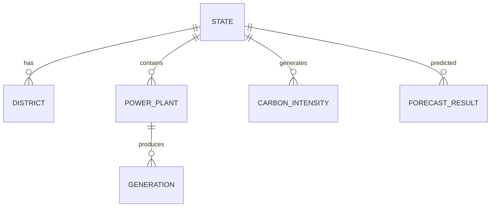

# GridSense AI Database Design

## 1. Database Overview
- **Database:** PostgreSQL
- **Extensions:**
  - PostGIS
  - UUID (`uuid-ossp` or `pgcrypto`)

---

## 2. Database Architecture
```text
Energy Atlas API
        │
        ▼
Data Ingestion
        │
        ▼
 PostgreSQL
        │
        ▼
 FastAPI
```

---

## 3. Naming Convention
- `snake_case`
- Singular table names
- `created_at`
- `updated_at`
- UUID primary keys

---

## 4. Schema Design
To ensure scalability, tables are separated into logical schemas rather than putting everything into `public`.

- **auth:** `user`, `role`, `session`
- **master:** `state`, `district`, `fuel_type`
- **energy:** `generation`, `demand`, `grid_frequency`, `power_plant`, `transmission_line`, `substation`
- **market:** `iex_market`, `energy_investment`
- **carbon:** `carbon_intensity`
- **analytics:** `forecast_result`, `model_registry`

---

## 5. Table Design

### Schema: `auth`

#### Table: `user`
**Purpose:** Stores application user accounts.
**Columns:**
- `id` (UUID)
- `email` (VARCHAR)
- `password_hash` (VARCHAR)
- `role_id` (UUID)
- `is_active` (BOOLEAN)
- `created_at` (TIMESTAMPTZ)
- `updated_at` (TIMESTAMPTZ)
**Primary Key:** `id`
**Foreign Keys:** `role_id -> auth.role(id)`
**Indexes:** B-Tree on `email`
**Relationships:** Belongs to one `role`, has many `session`s.

#### Table: `role`
**Purpose:** Defines user roles and permissions.
**Columns:**
- `id` (UUID)
- `name` (VARCHAR)
- `created_at` (TIMESTAMPTZ)
**Primary Key:** `id`
**Foreign Keys:** None
**Indexes:** B-Tree on `name`
**Relationships:** Has many `user`s.

#### Table: `session`
**Purpose:** Manages active user sessions.
**Columns:**
- `id` (UUID)
- `user_id` (UUID)
- `token` (VARCHAR)
- `expires_at` (TIMESTAMPTZ)
- `created_at` (TIMESTAMPTZ)
**Primary Key:** `id`
**Foreign Keys:** `user_id -> auth.user(id)`
**Indexes:** B-Tree on `token`, B-Tree on `user_id`
**Relationships:** Belongs to one `user`.

### Schema: `master`

#### Table: `state`
**Purpose:** Master data and spatial boundaries for states.
**Columns:**
- `id` (UUID)
- `name` (VARCHAR)
- `state_code` (VARCHAR)
- `region` (VARCHAR)
- `geom` (GEOMETRY(MultiPolygon, 4326))
- `created_at` (TIMESTAMPTZ)
**Primary Key:** `id`
**Foreign Keys:** None
**Indexes:** GiST on `geom`, B-Tree on `state_code`
**Relationships:** Has many `district`s, `power_plant`s, `demand` records, etc.

#### Table: `district`
**Purpose:** Spatial boundaries for districts.
**Columns:**
- `id` (UUID)
- `state_id` (UUID)
- `name` (VARCHAR)
- `geom` (GEOMETRY(MultiPolygon, 4326))
- `created_at` (TIMESTAMPTZ)
**Primary Key:** `id`
**Foreign Keys:** `state_id -> master.state(id)`
**Indexes:** GiST on `geom`, B-Tree on `state_id`
**Relationships:** Belongs to one `state`.

#### Table: `fuel_type`
**Purpose:** Master list of fuel types (Solar, Wind, Coal, etc.).
**Columns:**
- `id` (UUID)
- `name` (VARCHAR)
- `category` (VARCHAR)
- `created_at` (TIMESTAMPTZ)
**Primary Key:** `id`
**Foreign Keys:** None
**Indexes:** B-Tree on `name`
**Relationships:** Used by `power_plant` and `generation`.

### Schema: `energy`

#### Table: `power_plant`
**Purpose:** Stores utility-scale power plant information.
**Columns:**
- `id` (UUID)
- `plant_name` (VARCHAR)
- `state_id` (UUID)
- `fuel_type_id` (UUID)
- `installed_capacity` (NUMERIC)
- `owner` (VARCHAR)
- `status` (VARCHAR)
- `commissioned_date` (DATE)
- `geom` (GEOMETRY(Point, 4326))
- `created_at` (TIMESTAMPTZ)
- `updated_at` (TIMESTAMPTZ)
**Primary Key:** `id`
**Foreign Keys:** `state_id -> master.state(id)`, `fuel_type_id -> master.fuel_type(id)`
**Indexes:** GiST on `geom`, B-Tree on `state_id`, B-Tree on `fuel_type_id`
**Relationships:** Belongs to one `state`, produces many `generation` records.

#### Table: `generation`
**Purpose:** Stores time-series electricity generation data.
**Columns:**
- `id` (UUID)
- `power_plant_id` (UUID)
- `state_id` (UUID)
- `fuel_type_id` (UUID)
- `timestamp` (TIMESTAMPTZ)
- `generation_mw` (NUMERIC)
- `created_at` (TIMESTAMPTZ)
**Primary Key:** `id`
**Foreign Keys:** `power_plant_id -> energy.power_plant(id)`, `state_id -> master.state(id)`, `fuel_type_id -> master.fuel_type(id)`
**Indexes:** BRIN on `timestamp`, B-Tree on `state_id`
**Relationships:** Belongs to `power_plant`.

#### Table: `demand`
**Purpose:** Stores time-series electricity demand data.
**Columns:**
- `id` (UUID)
- `state_id` (UUID)
- `timestamp` (TIMESTAMPTZ)
- `demand_mw` (NUMERIC)
- `peak_demand_mw` (NUMERIC)
- `created_at` (TIMESTAMPTZ)
**Primary Key:** `id`
**Foreign Keys:** `state_id -> master.state(id)`
**Indexes:** BRIN on `timestamp`, B-Tree on `state_id`
**Relationships:** Belongs to `state`.

#### Table: `grid_frequency`
**Purpose:** Stores high-frequency grid stability data.
**Columns:**
- `id` (UUID)
- `timestamp` (TIMESTAMPTZ)
- `frequency_hz` (NUMERIC)
- `region` (VARCHAR)
- `created_at` (TIMESTAMPTZ)
**Primary Key:** `id`
**Foreign Keys:** None
**Indexes:** BRIN on `timestamp`, B-Tree on `region`
**Relationships:** None.

#### Table: `substation`
**Purpose:** Stores electrical substation locations and capacity.
**Columns:**
- `id` (UUID)
- `name` (VARCHAR)
- `state_id` (UUID)
- `voltage_kv` (INT)
- `capacity_mva` (NUMERIC)
- `geom` (GEOMETRY(Point, 4326))
- `created_at` (TIMESTAMPTZ)
- `updated_at` (TIMESTAMPTZ)
**Primary Key:** `id`
**Foreign Keys:** `state_id -> master.state(id)`
**Indexes:** GiST on `geom`, B-Tree on `state_id`
**Relationships:** Connects to `transmission_line`s.

#### Table: `transmission_line`
**Purpose:** Stores spatial paths for transmission networks.
**Columns:**
- `id` (UUID)
- `name` (VARCHAR)
- `voltage_kv` (INT)
- `length_ckm` (NUMERIC)
- `start_substation_id` (UUID)
- `end_substation_id` (UUID)
- `geom` (GEOMETRY(LineString, 4326))
- `created_at` (TIMESTAMPTZ)
- `updated_at` (TIMESTAMPTZ)
**Primary Key:** `id`
**Foreign Keys:** `start_substation_id -> energy.substation(id)`, `end_substation_id -> energy.substation(id)`
**Indexes:** GiST on `geom`
**Relationships:** Connects `substation`s.

### Schema: `market`

#### Table: `iex_market`
**Purpose:** Stores Indian Energy Exchange (IEX) market data.
**Columns:**
- `id` (UUID)
- `market_type` (VARCHAR)
- `timestamp` (TIMESTAMPTZ)
- `region` (VARCHAR)
- `mcp_rs_mwh` (NUMERIC)
- `mcv_mw` (NUMERIC)
- `buy_bid_mw` (NUMERIC)
- `sell_bid_mw` (NUMERIC)
- `created_at` (TIMESTAMPTZ)
**Primary Key:** `id`
**Foreign Keys:** None
**Indexes:** BRIN on `timestamp`, B-Tree on `market_type`
**Relationships:** None.

#### Table: `energy_investment`
**Purpose:** Stores CAPEX projects and funding information.
**Columns:**
- `id` (UUID)
- `state_id` (UUID)
- `project_name` (VARCHAR)
- `investor` (VARCHAR)
- `amount_cr` (NUMERIC)
- `status` (VARCHAR)
- `sector` (VARCHAR)
- `year` (INT)
- `created_at` (TIMESTAMPTZ)
- `updated_at` (TIMESTAMPTZ)
**Primary Key:** `id`
**Foreign Keys:** `state_id -> master.state(id)`
**Indexes:** B-Tree on `state_id`, B-Tree on `sector`
**Relationships:** Belongs to `state`.

### Schema: `carbon`

#### Table: `carbon_intensity`
**Purpose:** Stores calculated emissions tied to generation mix.
**Columns:**
- `id` (UUID)
- `state_id` (UUID)
- `timestamp` (TIMESTAMPTZ)
- `intensity_gco2_kwh` (NUMERIC)
- `created_at` (TIMESTAMPTZ)
**Primary Key:** `id`
**Foreign Keys:** `state_id -> master.state(id)`
**Indexes:** BRIN on `timestamp`, B-Tree on `state_id`
**Relationships:** Belongs to `state`.

### Schema: `analytics`

#### Table: `forecast_result`
**Purpose:** Stores AI predictions (demand, generation, price).
**Columns:**
- `id` (UUID)
- `target_entity` (VARCHAR)
- `target_id` (VARCHAR)
- `timestamp` (TIMESTAMPTZ)
- `metric_name` (VARCHAR)
- `predicted_value` (NUMERIC)
- `actual_value` (NUMERIC)
- `model_version` (VARCHAR)
- `created_at` (TIMESTAMPTZ)
**Primary Key:** `id`
**Foreign Keys:** None
**Indexes:** BRIN on `timestamp`, B-Tree on `target_entity`
**Relationships:** Loose coupling via `target_entity` and `target_id`.

#### Table: `model_registry`
**Purpose:** Tracks versions and metadata for deployed AI models.
**Columns:**
- `id` (UUID)
- `model_name` (VARCHAR)
- `version` (VARCHAR)
- `is_active` (BOOLEAN)
- `description` (TEXT)
- `created_at` (TIMESTAMPTZ)
- `updated_at` (TIMESTAMPTZ)
**Primary Key:** `id`
**Foreign Keys:** None
**Indexes:** B-Tree on `model_name`
**Relationships:** Used by `forecast_result`.

---

## 6. ER Diagram


---

## 7. Index Strategy
- **`state_id`**: B-Tree indexes on all tables referencing states (`district`, `power_plant`, `demand`, `generation`, `carbon_intensity`).
- **`timestamp`**: BRIN (Block Range INdexes) on all time-series tables (`generation`, `demand`, `grid_frequency`, `iex_market`, `carbon_intensity`, `forecast_result`) for fast temporal aggregations.
- **`plant_id`**: B-Tree index on `generation.power_plant_id`.
- **`fuel_type`**: B-Tree indexes on `power_plant.fuel_type_id` and `generation.fuel_type_id`.
- **`market_type`**: B-Tree index on `iex_market.market_type`.
- **`geom`**: GiST indexes on all spatial columns (`state.geom`, `power_plant.geom`, etc.).

---

## 8. Data Retention
- **Grid Frequency:** Forever
- **Demand:** Forever
- **Generation:** Forever
- **Weather:** Future (planned 1 year rolling)
- **Forecast Results:** 365 Days
- **Logs:** 90 Days

---

## 9. Backup Strategy
- **Daily Automated Backups:** Full database snapshot managed by Render PostgreSQL.
- **Point-in-Time Recovery (PITR):** Maintained for the last 7 days via WAL archiving on Render.
- **Cold Storage:** Monthly logical backups (`pg_dump`) exported to AWS S3 / Cloud Storage for long-term retention.
