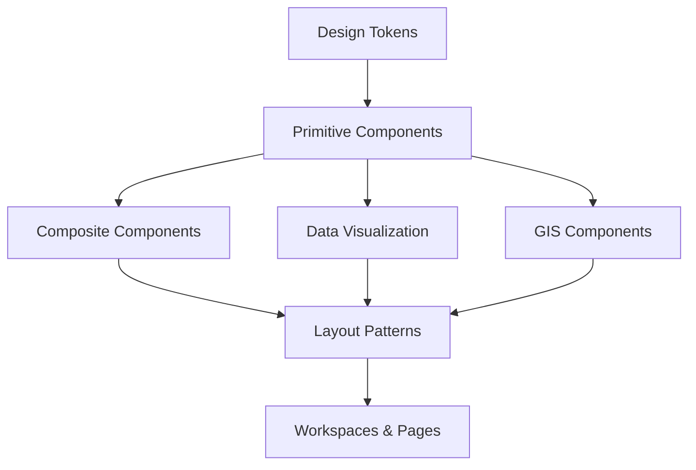

# GridSense AI: Design System & Component Library

This document defines the architectural structure of the GridSense AI Design System. Adopting the principles of **Atomic Design**, the system is structured in strict hierarchical layers, moving from foundational tokens to complex layouts. The goal is complete modularity, ensuring that GridSense AI can scale seamlessly across new energy verticals for years without requiring a structural redesign.

---

## Architecture Hierarchy

---

## 1. Design Tokens

Design Tokens are the absolute smallest, indivisible attributes of the UI. Hardcoded values (e.g., `#FF0000`, `16px`) are strictly forbidden in component definitions.

| Category | Token Pattern | Example Tokens | Purpose |
|----------|---------------|----------------|---------|
| **Colors** | `color-[intent]-[state]` | `color-primary-base`, `color-error-hover` | Semantic UI mapping. |
| **Typography** | `text-[scale]` | `text-h1`, `text-body`, `text-mono` | Responsive font-size, weight, and line-height. |
| **Spacing** | `space-[scale]` | `space-1` (4px), `space-4` (16px) | Margins, paddings, gaps. |
| **Radius** | `radius-[scale]` | `radius-sm`, `radius-full` | Border rounding. |
| **Elevation** | `elevation-[level]` | `elevation-flat`, `elevation-floating` | Z-index, shadows, and backdrop filters. |
| **Motion** | `duration-[speed]` | `duration-fast` (150ms), `duration-slow` (300ms) | Standardizing animation lengths. |
| **Breakpoints**| `bp-[size]` | `bp-md` (768px), `bp-xl` (1440px) | Media query anchors. |

---

## 2. Primitive Components

Primitives are the foundational UI building blocks (Atoms). They possess no business logic and are highly reusable.

### Common Primitives

| Component | Purpose | Variants | Accessibility & Usage |
|-----------|---------|----------|-----------------------|
| **Button** | Primary user actions. | Primary, Secondary, Ghost, Destructive | Must support `aria-label`, focus rings, and `disabled` states. |
| **Badge / Chip** | Displaying status or tags. | Neutral, Success, Warning, Error | Used for inline data categorization (e.g., "Active", "Curtailment"). |
| **Input / Select** | Data entry and configuration. | Standard, With Icon, Error State | Must have linked `<label>` and distinct focus indicators. |
| **Skeleton** | Pre-fetching visual placeholders. | Text Line, Circle, Rectangle | Must pulse using `motion-slow` token to indicate loading. |
| **Spinner** | Blocking action indicators. | Small, Large | Used when action takes >300ms. Provide `aria-live` regions. |
| **Tooltip** | Contextual metadata on hover. | Top, Bottom, Left, Right | Delay `300ms` on hover to prevent visual noise. |

---

## 3. Composite Components

Composites (Molecules & Organisms) combine Primitives with specific business context to form recognizable widgets.

### Business Composites

| Component | Content & Layout | Purpose |
|-----------|------------------|---------|
| **Metric Card** | Label, Large Numeric Value, Sparkline, Trend Arrow. | High-level KPIs (e.g., "Total Generation", "Market Clearing Price"). |
| **Forecast Card** | Actual vs Predicted line graph, Confidence Interval badge. | Displaying AI accuracy and future predictions. |
| **Asset Card** | Avatar (Plant icon), Title, Status Badge, Capacity Value. | Summary of a specific power plant or substation. |
| **Alert Card** | Severity Icon, Timestamp, Title, "Acknowledge" Button. | System warnings, threshold breaches, or anomaly detections. |
| **Grid Card** | Donut chart representing Energy Mix or Frequency Dial. | Snapshot of operational grid realities. |

**Extensibility Rule:** Composites accept `data` props, not hardcoded text. They flex based on container width (`bp-[size]`).

---

## 4. Navigation Components

Navigation defines the spatial movement through the application, organized around workflows rather than datasets.

- **Workspace Selector**: A top-level switcher (e.g., "Grid Ops" -> "Market Intel"). Completely changes the active layout and sidebar context.
- **Sidebar**: Vertical contextual navigation. Collapsible to icons-only for power users.
- **Command Palette**: Triggered via `Cmd+K`. The ultimate power-user tool. Allows instant search across plants, markets, configurations, and quick actions.
- **Breadcrumbs**: Spatial orientation (e.g., `Grid > Western Region > Gujarat > Plant Alpha`).
- **Context Menus**: Right-click or meatball-menu (`...`) dropdowns on tables/assets for deep-link actions (Export, Edit, Analyze).

---

## 5. Data Visualization Components

Given the analytical nature of GridSense AI, charts are treated as first-class components.

### Chart Standards
- **Line/Area Charts**: Primary tool for timeseries data (Frequency, Prices, Demand). Must support zooming and panning.
- **Stacked Bar Charts**: Used for Energy Mix (Coal + Solar + Hydro).
- **Heatmaps**: Calendar heatmaps for generation output or market volatility over time.
- **Sparklines**: Inline mini-charts placed within Tables or Metric Cards for instant trend context without taking up layout space.

### Standardized Chart Behaviors
- **Loading State**: Displays a Shimmering Skeleton over the chart bounds.
- **Hover/Tooltip**: Crosshair syncs across multiple charts on the same page (e.g., hovering on a price chart also moves the tooltip on the generation chart at the same timestamp).
- **Empty/Error**: Displays a centralized "Data Not Available" illustration, never a blank canvas.

---

## 6. GIS Components

The geographical mapping system is a core pillar. Maps are constructed using layered, composable components.

- **Base Map Layer**: The foundational cartography (Dark Mode/Light Mode satellite or topology).
- **Asset Layers**: Toggleable points for Power Plants, Substations.
- **Vector Layers**: Polylines representing the national transmission grid, dynamically colored by load/congestion.
- **Weather/Heatmap Layers**: Interpolated raster overlays displaying solar irradiance or wind vectors.
- **Map Toolbar**: Controls for Zoom, Pan, Measure, Layer Selection, and Time Slider (for historical/forecast playback).
- **Popups/Side Panels**: Clicking a map asset slides open a contextual Side Panel rather than opening a blocking modal, preserving the map view.

---

## 7. AI Components

AI is deeply integrated into the platform's DNA, rather than being isolated on an "AI Page."

- **AI Insight Panel**: Contextual text summaries that appear above complex charts, explaining the *why* (e.g., "Price spiked at 18:00 due to sudden wind drop in Tamil Nadu"). Uses the `color-ai-accent` token.
- **Confidence Indicator**: A subtle radial progress or badge next to forecast data displaying the ML model's confidence interval.
- **SHAP Visualization Container**: Expandable sections within Forecast Cards explaining *which variables* drove the prediction (e.g., Feature Importance).
- **Suggested Actions**: Smart buttons that appear during anomalies (e.g., "Recommend: Spin up hydro reserves").

---

## 8. Tables

Tables are designed for enterprise density, supporting thousands of rows.

- **Virtualization**: All tables must support row virtualization to ensure 60fps rendering regardless of dataset size.
- **Features**: Pinned columns (usually ID/Name on the left, Actions on the right), column sorting, multi-select checkboxes, and inline search.
- **Expandable Rows**: Clicking a row reveals a nested sub-table or chart (e.g., clicking a Region row expands to show State-level data).
- **Export**: Universal export controls (CSV, Excel) baked into the standard Table Toolbar component.

---

## 9. Forms

Forms are strictly validated, progressive, and intuitive.

- **Validation**: Inline, real-time validation. Error states use `color-error-base` and display clear helper text below the input.
- **Advanced Filters**: A composable query builder (e.g., `[Region] [equals] [North] AND [Fuel] [in] [Solar, Wind]`) rather than massive lists of dropdowns.
- **Step Forms (Wizards)**: Used for complex configurations (e.g., setting up a new ETL pipeline). Displays a sticky progress tracker on the left.

---

## 10. Layout Patterns

Layouts dictate how Composite Components are arranged on a screen.

| Layout Type | Description | Usage |
|-------------|-------------|-------|
| **Dashboard Layout** | Modular grid system (`Grid-12`). Components snap into place. | Executive Briefings, Overview screens. |
| **Master-Detail** | Left list (30% width), Right detail panel (70% width). | Exploring lists of Assets or Market Bids. |
| **Split Screen** | Two equal panels side-by-side. | Comparing Forecast vs Actuals; Scenario planning. |
| **Full Screen Map** | Map takes 100% viewport. Floating widgets overlay the map. | GIS Intelligence, Grid Operations. |

---

## 11. Empty, Loading & Error Patterns

Graceful degradation is vital for trust.

- **Loading**: Prefer contextual Skeletons over fullscreen Spinners to minimize layout shift.
- **No Data**: "Empty States" should explain *why* it is empty and offer a *Call to Action* (e.g., "No outages detected today. View historical outages ->").
- **API Error / Maintenance**: Friendly, localized error states with "Retry" buttons, ensuring a single failed widget doesn't crash the entire dashboard.

---

## 12. Notification System

Notifications are tiered based on urgency to prevent alert fatigue.

1. **Toast Notifications**: Ephemeral, auto-dismissing (5s) alerts in the bottom-right corner for background tasks (e.g., "Report exported successfully").
2. **Inline Alerts**: Persistent banners inserted directly at the top of a form or chart (e.g., "Data for this region is delayed by 15 mins").
3. **System Banners**: Global, top-of-screen bars for critical system-wide events (e.g., "Scheduled Maintenance in 30 mins").
4. **Live Event Stream**: A dedicated slide-out panel logging real-time websocket anomalies (e.g., "Grid frequency dropped below 49.95Hz").

---

## 13. Extensibility Rules

The Design System is architected so that new modules can be added in the future with zero structural redesign.

- **Adding a New Vertical (e.g., Battery Storage)**:
  1. Add a new `color-battery-accent` token.
  2. Instantiate a `Dashboard Layout`.
  3. Reuse `Metric Cards` and `Line Charts` feeding them battery SoC (State of Charge) data.
  4. Add a new `Asset Layer` to the GIS Map using the existing Map Toolbar.
- **Result**: The new vertical instantly inherits the exact same dark mode, accessibility standards, AI insight capability, and responsive layout as the rest of the application, taking days instead of months to launch.
