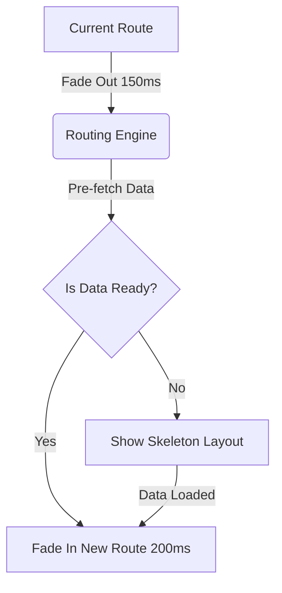

# GridSense AI: Experience, Motion & Interaction System

This document outlines the interaction model, motion philosophy, and user experience standards for GridSense AI. As an enterprise-grade intelligence platform, every animation, transition, and micro-interaction must serve a functional purpose—communicating system state, reducing cognitive load, or guiding user attention. Decorative motion is strictly prohibited.

---

## 1. Experience Principles

GridSense AI’s interaction model is built on the following core experience principles:

| Principle | Description |
|-----------|-------------|
| **Calm & Confident** | The interface should never feel frantic. Data updates, alerts, and AI insights arrive smoothly. The system projects reliability, crucial for national grid operations. |
| **High Information Density** | Complex data is presented without overwhelming the user. Progressive disclosure ensures users see the macro view first, with instant micro-interactions revealing granular details. |
| **Minimal Friction** | Navigating between a high-level executive dashboard and a deep-dive market anomaly should feel frictionless. Tooling should never get in the way of analysis. |
| **Guided Discovery** | The interface subtly guides the user toward anomalies or actionable insights using motion and color, ensuring critical events are never missed. |
| **Predictable** | Interactions behave exactly as expected. A sidebar always behaves like a sidebar; closing a modal always returns the user to their previous exact state. |

---

## 2. Motion Principles

Motion in GridSense AI is a functional tool. It explains the relationship between elements and provides spatial orientation.

- **Purposeful**: Motion must explain a change in state (e.g., expanding a table row pushes other rows down to show the content belongs inside).
- **Physics Inspired**: Animations use spring physics (mass, damping, stiffness) rather than linear easings. This makes elements feel like they have physical weight and momentum.
- **Fast but Noticeable**: Standard micro-interactions (hover, click) execute in `150ms`. Complex layout shifts execute in `300ms`. Motion should never make a user wait.
- **Reduced Motion Support**: The system must respect OS-level `prefers-reduced-motion` settings, falling back to simple crossfades or instant state changes for users with vestibular sensitivities.

**When NOT to use motion:**
- Continuous looping animations (except small, localized spinners).
- Elements flying in from completely off-screen without contextual origin.

---

## 3. Navigation Experience

Navigation must preserve context. Users often compare datasets across different workspaces.

- **Workspace Switching**: Selecting a new workspace (e.g., Grid Ops -> Analytics) crossfades the central layout while preserving the global sidebar and header, establishing that the user is still within the same application shell.
- **Command Palette (`Cmd+K`)**: Blurs the background immediately. Searching yields instantaneous results. Pressing `Escape` instantly returns the user exactly where they were, without a page reload.
- **Context Switching**: Deep linking to a specific asset (e.g., a power plant) opens in a contextual side-drawer rather than a new page, allowing the user to keep the parent data table in view.
- **Breadcrumbs**: Hovering over breadcrumbs highlights the entire path, allowing rapid upward navigation.

---

## 4. Page Transition System

Transitions provide spatial awareness, helping the user understand where data comes from.

- **Detail Page Transitions**: When clicking a card to view its details, the card expands (shared element transition) to become the header of the new page, establishing spatial continuity.
- **Overlays / Modals**: Slide in from the bottom or right, accompanied by a subtle backdrop dimming (`bg-black/50`). Dismissing reverses the exact animation.

---

## 5. Micro-Interactions

Micro-interactions provide immediate tactile feedback.

| Element | Interaction Behavior |
|---------|----------------------|
| **Buttons** | Scale down slightly (`0.98`) on click/press to simulate a physical push. |
| **Table Rows** | Highlight background instantly on hover. A subtle 2px primary border appears on the left edge to denote focus. |
| **Dropdowns** | Anchor to the triggering button. Appear via a quick scale-and-fade (`scale 0.95 -> 1.0`). |
| **Charts** | Hovering over a chart series instantly snaps a vertical crosshair and tooltip to the nearest data point. No delay. |
| **Tabs** | An active indicator (pill or underline) slides smoothly using spring physics between selected tabs. |

---

## 6. AI Experience

AI interactions in GridSense AI are woven into the fabric of the platform, avoiding the "isolated chatbot" anti-pattern.

- **Thinking State**: When the AI is generating an insight, a localized, pulsing shimmer effect is applied to the specific card or text block, indicating localized processing.
- **Streaming Responses**: AI text outputs render progressively (token-by-token) to provide immediate feedback that the model is working.
- **Contextual Explanations**: Hovering over a complex anomaly triggers a small AI tooltip offering a one-sentence summary.
- **Confidence Display**: Predictive charts overlay a shaded "cone of uncertainty." Hovering reveals the exact statistical confidence interval.

---

## 7. GIS Experience

Geospatial intelligence requires flawless performance and intuitive spatial navigation.

- **Zooming**: Smooth, momentum-based zooming. As zoom depth increases, macro layers (States) smoothly dissolve into micro layers (Substations).
- **Cluster Expansion**: Clicking a clustered node of power plants smoothly explodes the cluster into individual geographical points.
- **Time Slider**: Dragging a historical playback slider updates the map layers instantly. If data is buffering, the slider track pulses to indicate loading.
- **Side Panels**: Clicking a map asset triggers a right-aligned drawer. The map automatically pans to ensure the selected asset is not occluded by the drawer.

---

## 8. Data Refresh Experience

Real-time operations demand transparent data freshness indicators.

- **Live Streaming**: Data grids receiving WebSocket updates flash the updated cell background briefly (e.g., light green for 500ms) before fading to normal.
- **Freshness Indicators**: Every dashboard displays a "Last Updated: X seconds ago" pill. If polling fails or WebSocket disconnects, the pill turns amber and pulses.
- **Offline Mode**: If network connectivity drops, the UI does not crash. A global banner appears ("You are viewing offline/cached data"), and forms/actions gracefully disable themselves.

---

## 9. Loading Experience

Loading must feel continuous. Users should never stare at a blank screen.

- **Skeletons**: Used for initial data fetches. Skeletons must match the exact layout of the incoming data (e.g., a table skeleton shows rows and columns).
- **Progressive Rendering**: The application shell (sidebar, header, navigation) renders instantly. Heavy widgets load asynchronously and independently.
- **Background Processing**: For long ETL jobs or ML model training, the user clicks "Start" and the action button turns into a mini progress ring. The user is free to navigate away.

---

## 10. Empty States

Empty states are opportunities to educate or guide the user.

- **No Data**: Display a beautifully minimalist illustration related to the domain, accompanied by plain text (e.g., "No curtailment events detected today.") and a primary action button ("View Historical Events").
- **No Search Results**: Never just say "Not Found." Provide fuzzy-matched suggestions or quick links to common searches.

---

## 11. Error Experience

Errors are inevitable, but confusion is not.

- **Component Boundaries**: A failing API call for a specific weather widget must only crash that widget. It displays a local "Data Unavailable" state with a "Retry" button. The rest of the dashboard remains operational.
- **Non-Technical Language**: Never show raw JSON stack traces to the user. Translate `502 Bad Gateway` to "Unable to connect to the Market API. Retrying in 5 seconds..."
- **Validation Errors**: Forms validate inline, instantly upon `blur` (losing focus). Red outlines are accompanied by clear, actionable subtext.

---

## 12. Notification Experience

Notifications protect the user's attention.

- **Toasts**: Appear bottom-right for transient success states ("Report exported"). Dismiss automatically after 4 seconds.
- **Banners**: Stick to the top of the workspace for persistent, actionable warnings ("Grid frequency critical in Northern Region"). Remain until acknowledged.
- **Notification Center**: A slide-out drawer collecting all historical alerts, allowing users to filter by "AI Insights," "System Health," or "Market Alerts."

---

## 13. Accessibility

Accessibility is treated as a core architectural requirement, not a checklist.

- **Keyboard Navigation**: The entire platform is navigable via `Tab` and `Shift+Tab`. Elements receive a highly visible focus ring (offset by 2px to ensure contrast against any background).
- **Screen Readers**: Skeletons, charts, and maps use `aria-hidden="true"`, while visually hidden `` elements provide context to screen readers (e.g., `Grid frequency is currently 50.02 Hertz`).
- **Color Blindness**: Status indicators (Success, Warning, Error) always pair their color with a distinct geometric icon (Checkmark, Triangle, Octagon).

---

## 14. Responsive Behaviour

GridSense AI fluidly adapts from mobile devices to massive control-room screens.

- **Ultra-Wide (Control Rooms)**: Dashboards expand to utilize 100% of horizontal space. Columns in tables expand, and charts reveal higher-granularity axes.
- **Desktop/Laptop**: The standard, optimized view.
- **Tablet**: Sidebars collapse into icons. Modals take up higher screen percentage. Hover interactions gracefully degrade to tap interactions.
- **Mobile**: Heavy GIS and complex tables are simplified into summary cards and stacked list-views. 

---

## 15. Performance Experience

Perceived performance is as important as actual performance.

- **Optimistic UI**: When a user updates a configuration (e.g., "Acknowledge Alert"), the UI updates instantly. The API request happens in the background. If it fails, the UI rolls back and shows a toast error.
- **Virtualization**: Tables and long dropdowns use DOM virtualization, rendering only the elements currently visible in the viewport, ensuring 60fps scrolling even with 100,000 rows.

---

## 16. Future Experience Strategy

The interaction system is built to absorb new modalities without friction.

- **Voice / Agentic AI**: As conversational interfaces evolve, the existing "AI Insight Panel" can effortlessly transition into a voice-driven Copilot, sliding over the UI just like current side-panels.
- **Digital Twins & 3D**: The GIS map component is architected so the 2D layer can be seamlessly swapped for a 3D WebGL canvas when rendering physical substations or turbines, using the exact same zoom and pan interaction models.
- **Collaborative Workspaces**: Hover states and selection models are designed with multi-player in mind (e.g., seeing a colleague's cursor highlighting a specific market bid).
