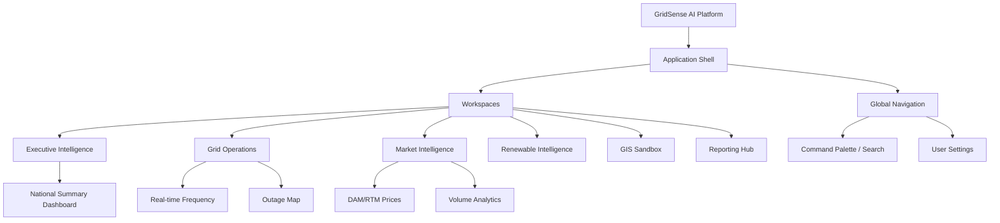
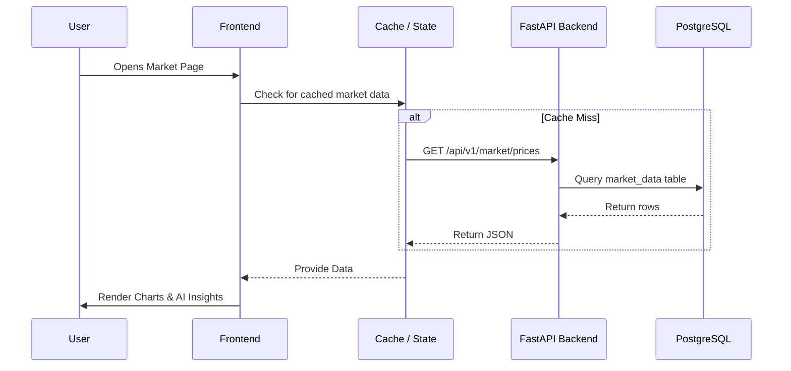
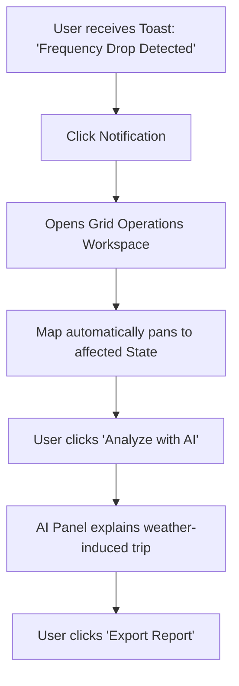

# GridSense AI: Application Blueprint & Platform Architecture

This document serves as the master architectural reference for the GridSense AI frontend. It defines the structural organization, navigation, modular boundaries, and conceptual technical architecture required to execute Sprint 7 (Frontend Development). 

---

## 1. Platform Overview

GridSense AI is an enterprise-grade Energy Intelligence Platform. The application is organized into **Workspaces**—distinct, workflow-driven environments that seamlessly share global state, authentication, and core UI components. 

Users move between workspaces using a persistent Global Sidebar. While the data context changes heavily between workspaces (e.g., viewing Market Clearing Prices vs. Grid Frequency), the interaction models, map controls, and AI features remain identical, ensuring a cohesive platform experience.

---

## 2. Information Architecture

The platform architecture is shallow but wide, prioritizing rapid context switching over deep hierarchical menus.

---

## 3. Global Navigation Blueprint

Navigation is anchored by three primary systems:

| Navigation Element | Purpose | Behavior |
|-------------------|---------|----------|
| **Global Sidebar** | Primary workspace switching. | Collapsible. Persists across the entire session. Top items are workspaces; bottom items are Settings/Profile. |
| **Command Palette (`Cmd+K`)** | Universal search and quick actions. | Blurs the background. Allows jumping directly to a specific asset, report, or configuration pane. |
| **Breadcrumbs** | Spatial awareness within a deep dive. | Located in the top header. e.g., `Grid Operations > Western Region > Gujarat`. |
| **Context Tabs** | Secondary navigation within a workspace. | e.g., Inside Market Intelligence: `Prices` \| `Volumes` \| `Forecasts`. |

---

## 4. Workspace Blueprint

Each workspace is a modular silo of related workflows.

### Executive Workspace
- **Purpose**: High-level macro view of national energy security and economics.
- **Primary Users**: C-Suite, Government Ministers.
- **Widgets**: National Demand vs Capacity, Renewable Mix %, AI Summary Briefing.
- **Entry Points**: Default landing page for Executive roles.

### Grid Operations Workspace
- **Purpose**: Real-time monitoring of physical infrastructure.
- **Primary Users**: Dispatch Operators, Engineers.
- **Data Sources**: High-frequency telemetry (Frequency, Voltage, Load).
- **Widgets**: Frequency Gauges, Transmission Heatmaps, Anomaly Alerts.

### Market Intelligence Workspace
- **Purpose**: Financial analysis of energy trading.
- **Primary Users**: Traders, Procurement Analysts.
- **Data Sources**: IEX Day-Ahead and Real-Time markets.
- **Widgets**: Candlestick charts, Order Book Depth, Arbitrage AI Insights.

### Renewable Intelligence Workspace
- **Purpose**: Monitoring volatile generation sources.
- **Primary Users**: Asset Managers, Forecasters.
- **Data Sources**: Solar Irradiance, Wind Speed, Installed Capacity.
- **Widgets**: CUF (Capacity Utilization) trackers, Weather overlay maps.

---

## 5. Page Blueprint

*Example: Market Pricing Page Blueprint*

| Attribute | Definition |
|-----------|------------|
| **Purpose** | Analyze historical and live clearing prices on the exchange. |
| **Target User** | Market Analyst. |
| **Primary Actions** | Filter by Date Range, Compare DAM vs RTM. |
| **Secondary Actions** | Export to CSV, Generate AI Summary. |
| **Required Data** | Timeseries pricing data, Trading volumes. |
| **Backend APIs** | `GET /api/v1/market/prices`, `GET /api/v1/market/volumes` |
| **Charts** | Synchronized multi-axis line chart (Price on Y1, Volume on Y2). |
| **AI Features** | "Explain Spike" button on chart peaks. |
| **Empty State** | "No market data available for selected date range." |

---

## 6. Backend Integration Blueprint

The frontend communicates with the FastAPI backend via RESTful endpoints.

- **Authentication**: JWT tokens stored securely. Appended to the `Authorization: Bearer` header via an Axios/Fetch interceptor.
- **Caching**: The frontend utilizes a data-fetching library (e.g., React Query/SWR conceptually) to cache `GET` requests, minimizing redundant network calls.
- **Pagination**: Grid endpoints use Offset/Limit pagination. The frontend maps this to virtualized infinite-scroll tables.
- **Error Handling**: Global interceptors catch `401 Unauthorized` (redirect to login) and `500 Server Error` (display generic toast), passing `400` errors down to specific form components.

---

## 7. Data Flow Architecture

---

## 8. AI Integration Blueprint

AI is a ubiquitous layer, not a destination.

- **Contextual Insights**: Above complex charts, a subtle AI panel summarizes the visible data (e.g., "Wind generation dropped 40% yesterday due to unseasonal calm").
- **Explainability (SHAP)**: When a Forecast is displayed, clicking "Why?" opens a drawer showing feature importance (e.g., "Temperature contributed +15% to this demand peak").
- **Copilot**: A floating chat widget available globally, maintaining context. If the user asks "What caused this?", the Copilot knows "this" refers to the currently open Market Pricing chart.

---

## 9. GIS Blueprint

The GIS architecture is a layered, composable map engine.

- **Base Maps**: Dark/Light vector tiles.
- **Asset Layers**: Point geometries (Power Plants, Substations) clustered at high zoom levels.
- **Choropleth Layers**: State/District polygons colored by energy deficit or capacity.
- **Raster/Weather Layers**: Interpolated heatmaps for solar irradiance.
- **Time Slider**: A global component that syncs map data to a specific historical hour, playing back weather and demand changes simultaneously.

---

## 10. User Flow Blueprint

*Workflow: Investigating a Grid Anomaly*

---

## 11. Permission Model

Permissions dictate UI rendering. If a user lacks access, the UI element is removed, not disabled.

| Role | Accessible Modules | Capabilities |
|------|-------------------|--------------|
| **Administrator** | All | User management, API key generation, System config. |
| **Executive** | Executive, Reports | Read-only global view, PDF Exports, AI Summaries. |
| **Grid Operator** | Grid Ops, Weather | Real-time telemetry access, Anomaly acknowledgment. |
| **Analyst** | Market, Analytics, Forecast | CSV Exports, Deep data querying, Model accuracy reviews. |

---

## 12. Reporting Blueprint

Reports are generated seamlessly from the UI.
- **Custom Reports**: Any Dashboard layout can be saved as a "View" and exported to PDF via a backend headless browser service.
- **Data Export**: Every table and chart has a standard `...` menu with "Export to CSV/Excel".
- **Scheduled Reports**: Analysts can configure a UI wizard to email a specific Market Dashboard snapshot every morning at 8:00 AM.

---

## 13. Search & Discovery

The **Command Palette (`Cmd+K`)** is the universal discovery engine.
- **Entity Search**: Typing "Mundra" returns the Mundra Thermal Power Plant asset page.
- **Navigation Search**: Typing "Prices" suggests the Market Intelligence workspace.
- **Natural Language**: Typing "Why is frequency low?" passes the query to the AI Copilot.

---

## 14. Notification & Event Architecture

- **Live Events**: WebSockets push critical alerts (e.g., `FREQUENCY_DROP`). The frontend maps these to high-priority Banners.
- **Background Jobs**: Triggering an ML forecast returns a `202 Accepted`. A toast displays "Forecast generating...". The frontend polls or listens to a WebSocket until completion, updating the toast to "Forecast Ready".

---

## 15. Platform Configuration

User and Tenant configurations persist globally:
- **Themes**: System / Dark / Light.
- **Localization**: Date formats (`DD/MM/YYYY` vs `MM/DD/YYYY`), Timezones (IST vs UTC).
- **Units**: MW vs GW, ₹ vs $.
- **Saved Layouts**: Users can drag-and-drop widget orders on their personal dashboard and save the configuration state.

---

## 16. Future Module Architecture

When a new module (e.g., **Battery Storage**) is added:
1. A new route `/workspace/battery` is registered.
2. The Global Sidebar dynamically injects a "Battery" icon based on permissions.
3. The module reuses the existing `MetricCard`, `TimeseriesChart`, and `MapLayer` components.
4. No core structural redesign of the shell, routing, or state management is required.

---

## 17. Technical Frontend Architecture (Conceptual)

The codebase will follow a Feature-Sliced Design pattern to guarantee maintainability.

- **`/app`**: Global routing, shell layouts, and context providers (Auth, Theme).
- **`/shared`**: Dumb, highly reusable UI primitives (Buttons, Inputs) and generic hooks (`useClickOutside`).
- **`/features`**: Business-specific modules (e.g., `market-charts`, `grid-map`). A feature contains its own localized API hooks, state, and components.
- **State Management**: Server state (API data) is managed via a dedicated caching layer. Client state (Sidebar open/close) is managed via lightweight atomic stores.
- **Routing**: File-system based or declarative routing, supporting nested layouts (e.g., Map persists while side-panels swap out via URL changes).

---

## 18. Sprint 7 Roadmap

Sprint 7 will execute this blueprint, moving from foundation to full production frontend.

| Milestone | Objectives | Deliverables |
|-----------|------------|--------------|
| **7.1 Foundation** | Scaffold repo, setup linters, routing, auth context. | Empty shell with login page. |
| **7.2 Core Layout** | Sidebar, Command Palette, Theme switching. | Navigable application shell. |
| **7.3 Components** | Build Design System Primitives (Buttons, Cards). | Storybook/Component library. |
| **7.4 Data Viz** | Integrate charting libraries, define standard line/bar charts. | Reusable Chart wrappers. |
| **7.5 GIS Base** | Integrate Map library, define base layers. | Interactive national map. |
| **7.6 Workspaces** | Assemble Market, Grid, and Exec workspaces using composites. | Functioning data pages. |
| **7.7 AI & API** | Connect frontend to backend REST APIs and AI endpoints. | Live data flowing into UI. |
| **7.8 Polish** | Implement motion, micro-interactions, empty states. | Premium UX feel achieved. |
| **7.9 Production** | Performance tuning, virtualization, build optimization. | Deployment-ready bundle. |
