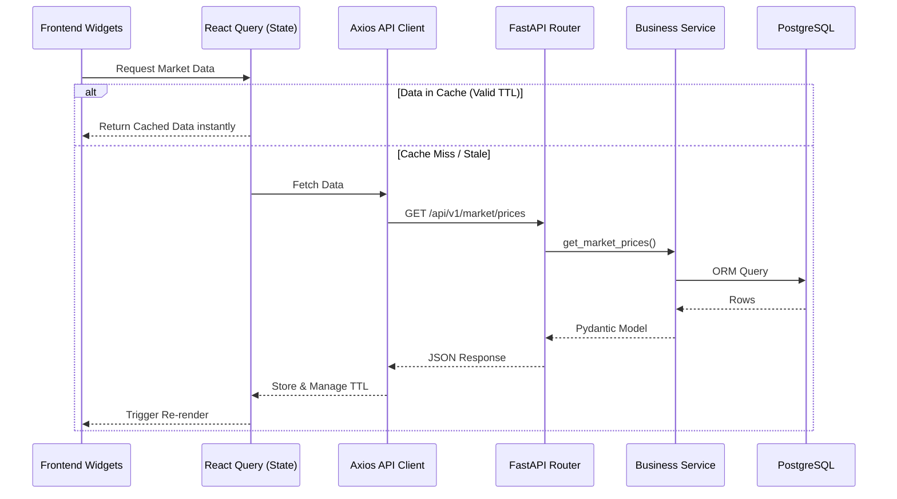

# GridSense AI: API Mapping

This document maps the completed FastAPI backend endpoints to the frontend application blueprint. It serves as the definitive data contract for Frontend Engineering (Sprint 7), detailing how UI widgets fetch, cache, and display data.

---

## Frontend ⟷ Backend Architecture Flow

---

## 1. Global Platform APIs

### 1.1 Authentication & Shell Initialization
Called globally when the application boots or when a user logs in.

| Attribute | Specification |
|-----------|---------------|
| **Endpoint** | `/api/v1/auth/login/access-token` |
| **Method** | `POST` |
| **Request** | `OAuth2PasswordRequestForm` (username, password) |
| **Response** | `Token` (access_token, token_type) |
| **Loading Strategy** | Full screen blocking spinner. |
| **Error Handling** | 401: Shake animation on password field with inline error. |

| Attribute | Specification |
|-----------|---------------|
| **Endpoint** | `/api/v1/users/me` |
| **Method** | `GET` |
| **Response** | `UserResponse` (id, email, full_name, is_active, is_superuser) |
| **Permissions** | Automatically drives the rendering of Workspace Navigation items. |

---

## 2. Executive Workspace

### 2.1 Executive Summary Dashboard
A high-level view combining system health, market summaries, and AI insights.

| Attribute | Specification |
|-----------|---------------|
| **Endpoint** | `/api/v1/dashboard/executive-summary` |
| **Method** | `GET` |
| **Authentication**| Bearer Token |
| **Response** | Aggregated payload of system status, market indices, and generation totals. |
| **Caching** | TTL: 5 minutes. |
| **Polling** | Background fetch every 5 minutes. |
| **Loading Strategy**| Modular skeletons for each metric card. |
| **Permissions** | Requires Executive or Admin role. |
| **Export Support** | "Export to PDF" button sends the DOM to a client-side PDF renderer. |

---

## 3. Market Intelligence Workspace

### 3.1 Market Pricing Page
Displays Day-Ahead (DAM) and Real-Time (RTM) clearing prices.

| Attribute | Specification |
|-----------|---------------|
| **Endpoint** | `/api/v1/analytics/market-summary` |
| **Method** | `GET` |
| **Request** | Query Params: `start_date`, `end_date`, `region_id` |
| **Response** | Timeseries array of prices and volumes. |
| **Filtering / Sort**| Frontend UI provides Date Range Picker and Region Multi-Select. |
| **Caching** | TTL: 15 minutes (Market data is highly cacheable post-clearing). |
| **Loading Strategy**| Chart skeleton overlay. |
| **Error Handling** | Localized widget error boundary with a "Retry" button. |
| **Export Support** | Standard CSV export via frontend JSON-to-CSV utility. |

---

## 4. Grid Operations Workspace

### 4.1 Real-Time Operations Dashboard
Mission-critical view of physical grid telemetry.

| Attribute | Specification |
|-----------|---------------|
| **Endpoint** | `/api/v1/dashboard/live-status` |
| **Method** | `GET` |
| **Response** | Current frequency, operational alerts, real-time load. |
| **Polling** | Aggressive background polling (e.g., every 10-30 seconds) or WebSocket subscription depending on phase rollout. |
| **Loading Strategy**| Instant render from cache, with subtle pulsing indicator for live sync. |
| **Realtime Support**| Frontend listens for frequency drops; flashes red critical banner if frequency < 49.90 Hz. |
| **Permissions** | Operator or Admin role. |

### 4.2 Power Plants (Asset Management)
Grid topology and generating stations.

| Attribute | Specification |
|-----------|---------------|
| **Endpoint** | `/api/v1/energy/power-plants` |
| **Method** | `GET` |
| **Request** | `skip`, `limit`, `fuel_type`, `state` |
| **Response** | Paginated array of `PowerPlant` entities. |
| **Pagination** | Offset/Limit mapped to a virtualized data table. |
| **Search / Filter** | Command Palette fuzzy search; Column-level dropdown filters. |
| **Caching** | TTL: 1 Hour (Asset metadata rarely changes). |

---

## 5. Forecasting & AI Workspace

### 5.1 AI Forecast Generator
Machine learning predictions for load and renewable generation.

| Attribute | Specification |
|-----------|---------------|
| **Endpoint** | `/api/v1/forecast/generate` |
| **Method** | `POST` |
| **Request** | `ForecastRequest` (target_date, model_type, parameters) |
| **Response** | 202 Accepted (if async job) or direct `ForecastResponse`. |
| **Loading Strategy**| AI Shimmer animation on the predictive chart card. |
| **Error Handling** | If ML model fails to converge, display non-technical error: "Forecast generation timed out. Try adjusting the parameters." |

### 5.2 Forecast Accuracy Metrics
| Attribute | Specification |
|-----------|---------------|
| **Endpoint** | `/api/v1/forecast/accuracy` |
| **Method** | `GET` |
| **Response** | MAPE, RMSE, and confidence intervals. |
| **Caching** | TTL: 12 Hours (calculated overnight). |

---

## 6. Global Search & Command Palette

### 6.1 Universal Discovery
Triggered by `Cmd+K`.

| Attribute | Specification |
|-----------|---------------|
| **Endpoint** | `/api/v1/search/universal` (Conceptual/Aggregated) |
| **Method** | `GET` |
| **Request** | `q={query_string}` |
| **Response** | Grouped results: Assets, Reports, Market Data, Nav Links. |
| **Debounce** | Frontend input is debounced by 250ms before triggering API. |
| **Loading Strategy**| Inline micro-spinner inside the search input field. |

---

## 7. System Health & Observability

### 7.1 Readiness & Liveness
Used primarily by DevOps, but powers the frontend "System Status" footer icon.

| Attribute | Specification |
|-----------|---------------|
| **Endpoint** | `/api/v1/health/live` |
| **Method** | `GET` |
| **Polling** | Polled every 60 seconds by the application shell. |
| **Error Handling** | If 503 or timeout, the global status dot turns red, triggering a "System Degraded" banner. |

---

## 8. Export Strategy

While some data is downloaded directly via the API, the majority of the CSV and PDF export functionality is handled **Client-Side** to reduce server load:
- **CSV**: Frontend transforms the cached JSON timeseries array into a Blob and forces a download.
- **PDF**: Frontend uses a library like `html2canvas` or `jsPDF` to snap the current Dashboard layout and print it.

---

## 9. Error Mapping Dictionary

The frontend API Client uses interceptors to universally handle standard HTTP codes:

- **400 Bad Request**: Mapped to Form Validation states. Input fields are outlined in red with helper text.
- **401 Unauthorized**: Wipes local state, revokes token, and redirects to Login screen with a toast: "Session Expired".
- **403 Forbidden**: Displays an Empty State component: "You do not have permission to view this workspace."
- **404 Not Found**: Routes to the standard `404` React route page.
- **500 Internal Server Error**: Triggers the Widget-level Error Boundary ("Widget failed to load").
- **Network Error (Timeout)**: Displays "You are currently offline. Showing cached data."
