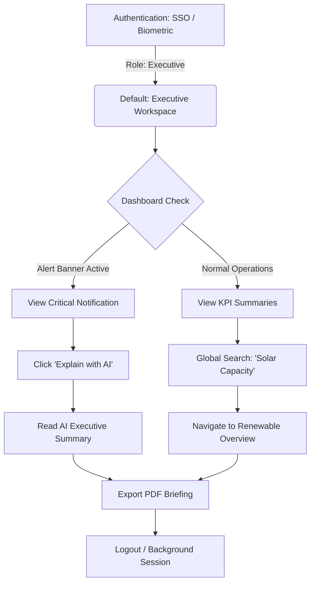
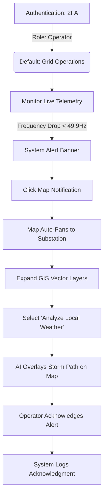
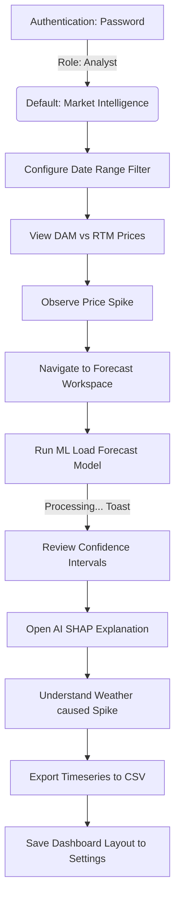
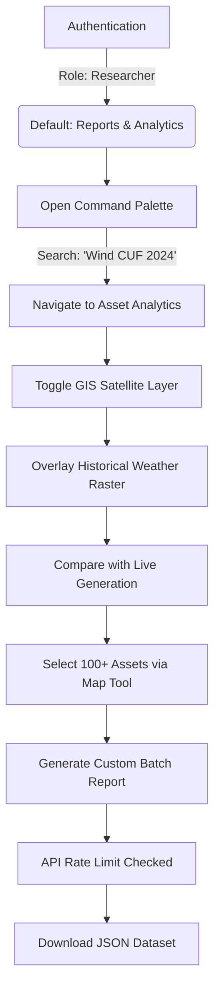
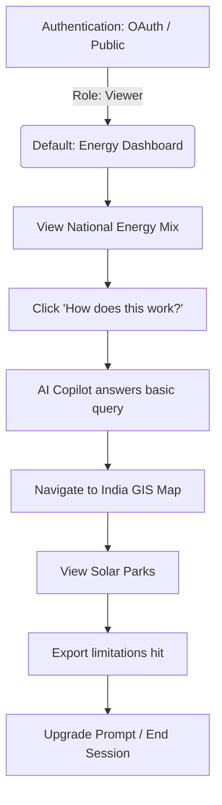
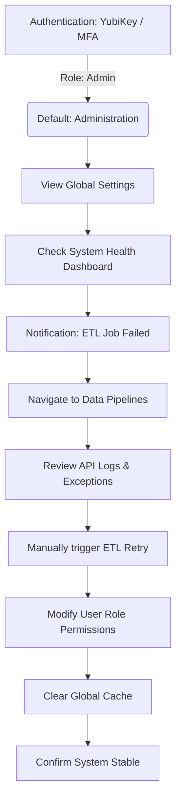

# GridSense AI: User Flow Blueprint

This document defines the comprehensive user journeys for each primary persona in GridSense AI. By mapping exact behavioral workflows, we ensure the platform seamlessly accommodates vastly different user goals—from macro-economic executive briefings to real-time micro-level grid anomaly investigations.

---

## 1. The Executive Workflow (Strategic Overview)
**Persona**: CEO, Government Minister.
**Goal**: Rapid understanding of national energy security and macroeconomic trends in under 5 minutes.

**Permissions Note**: Executives possess sweeping read permissions across all workspaces but generally lack write/configuration permissions to prevent accidental system changes.

---

## 2. The Grid Operator Workflow (Real-Time Tactical)
**Persona**: Load Dispatch Center Operator.
**Goal**: Ensuring grid stability, monitoring telemetry, and managing sudden outages.

**Permissions Note**: Operators have exclusive write access to operational acknowledgment flags and override capabilities in the GIS/Grid workspaces.

---

## 3. The Analyst Workflow (Deep Investigation)
**Persona**: Energy Trader, Market Analyst.
**Goal**: Investigating historical data to build trading strategies and forecast load.

**Permissions Note**: Analysts possess execution permissions for heavy ML generation jobs and massive data export limits.

---

## 4. The Researcher Workflow (Data Exploration)
**Persona**: Data Scientist, Academic.
**Goal**: Exploring raw datasets and correlating long-term climate data with generation efficiency.

**Permissions Note**: Researchers are tightly constrained by API rate limits and cannot access real-time critical operational telemetry to prevent server load.

---

## 5. The Student / Public Viewer Workflow (Educational)
**Persona**: University Student, General Public.
**Goal**: General learning about the energy transition.

**Permissions Note**: Viewers have strict Read-Only access. ML Forecasting and heavy ETL exports are entirely disabled.

---

## 6. The Administrator Workflow (System Configuration)
**Persona**: Platform DevOps, IT Admin.
**Goal**: Managing system health, resolving user permission issues, and monitoring ETL pipelines.

**Permissions Note**: Administrators bypass all RBAC restrictions, possessing universal Write/Delete/Configure permissions across the entire platform architecture.
